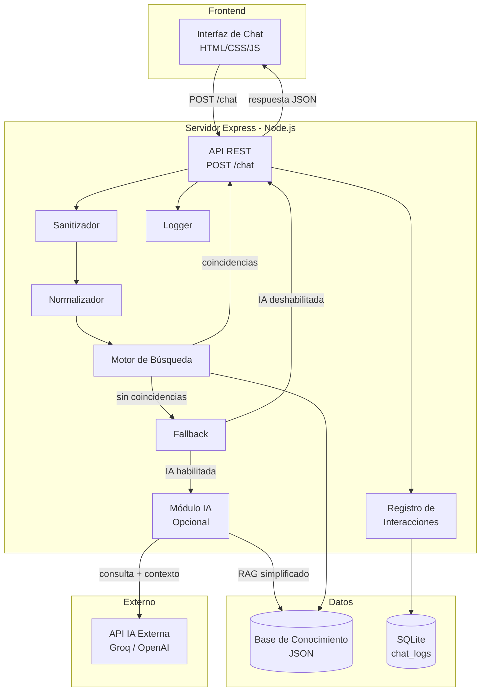
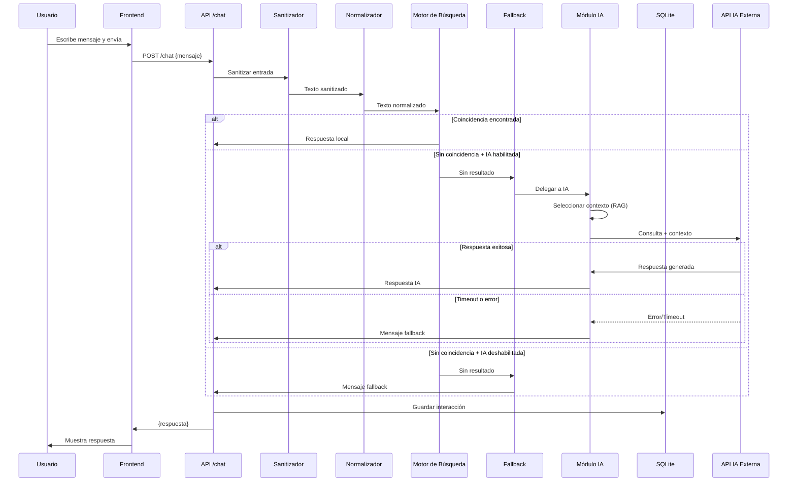

# Documento de Diseño — Chatbot Web CETI

## Visión General

Este documento describe el diseño técnico del chatbot web para el Centro de Enseñanza Técnica Industrial (CETI). El sistema es una aplicación web conversacional que responde preguntas frecuentes de estudiantes y prospectos sobre inscripciones, carreras, costos, requisitos y ubicación.

La arquitectura sigue un modelo cliente-servidor simple:
- **Frontend**: Interfaz de chat construida con HTML, CSS y JavaScript vanilla, servida como archivos estáticos.
- **Backend**: Servidor Node.js con Express que expone una API REST, procesa mensajes mediante un pipeline de normalización y búsqueda, y opcionalmente delega a un servicio de IA externo.
- **Persistencia**: SQLite para registro de interacciones; archivos JSON para la base de conocimiento.

El sistema está diseñado para ejecutarse en una Raspberry Pi con recursos limitados, funcionar sin conexión a internet para búsquedas locales, y ser modular para facilitar la extensión futura.

## Arquitectura

### Diagrama de Arquitectura General



### Flujo de Procesamiento de Mensajes




## Componentes e Interfaces

### 1. Frontend (Interfaz de Chat)

**Responsabilidad**: Presentar la interfaz conversacional y comunicarse con el backend.

**Archivos**:
- `public/index.html` — Estructura HTML del chat
- `public/styles.css` — Estilos responsivos (breakpoint 768px)
- `public/app.js` — Lógica de envío, renderizado de mensajes, validación de entrada

**Interfaz con Backend**:
```
POST /chat
Content-Type: application/json

Request:  { "mensaje": string }
Response: { "respuesta": string }
Error 400: { "error": string }
Error 500: { "error": string }
```

**Comportamiento clave**:
- Deshabilita envío cuando el campo de entrada está vacío
- Envía mensaje con Enter o clic en botón
- Renderiza mensajes en orden cronológico con distinción visual usuario/bot
- Mantiene historial visual durante la sesión (solo en memoria del DOM)

### 2. API REST (`routes/chat.js`)

**Responsabilidad**: Recibir peticiones, orquestar el pipeline de procesamiento y devolver respuestas.

```javascript
// POST /chat
// Input:  { mensaje: string }
// Output: { respuesta: string }
// Errors: 400 (mensaje vacío/ausente/largo), 500 (error interno)
```

**Pipeline de procesamiento**:
1. Validar presencia y longitud del campo `mensaje` (máx. 500 caracteres)
2. Sanitizar entrada
3. Normalizar texto
4. Buscar en base de conocimiento
5. Si no hay resultado → fallback (con o sin IA)
6. Registrar interacción en SQLite
7. Devolver respuesta

### 3. Sanitizador (`modules/sanitizer.js`)

**Responsabilidad**: Eliminar contenido potencialmente peligroso de la entrada del usuario.

```javascript
/**
 * Elimina etiquetas HTML y caracteres peligrosos del texto.
 * @param {string} input - Texto crudo del usuario
 * @returns {string} Texto sanitizado
 */
function sanitize(input: string): string
```

**Reglas**:
- Eliminar todas las etiquetas HTML (`<script>`, ``, etc.)
- Eliminar caracteres de control
- Preservar letras, números, espacios, signos de puntuación básicos

### 4. Normalizador (`modules/normalizer.js`)

**Responsabilidad**: Transformar texto a forma canónica para búsqueda.

```javascript
/**
 * Normaliza texto: minúsculas, sin acentos, sin caracteres especiales.
 * @param {string} input - Texto sanitizado
 * @returns {string} Texto normalizado (solo letras, números, espacios)
 */
function normalize(input: string): string
```

**Transformaciones** (en orden):
1. Convertir a minúsculas
2. Eliminar acentos/diacríticos (NFD + regex)
3. Eliminar todo excepto letras, números y espacios
4. Colapsar espacios múltiples

**Propiedad clave**: La normalización es idempotente — `normalize(normalize(x)) === normalize(x)`.

### 5. Motor de Búsqueda (`modules/searchEngine.js`)

**Responsabilidad**: Encontrar la mejor respuesta en la base de conocimiento.

```javascript
/**
 * Busca la mejor coincidencia en la base de conocimiento.
 * @param {string} normalizedText - Texto normalizado del usuario
 * @param {Array<KBEntry>} knowledgeBase - Entradas cargadas en memoria
 * @returns {{ found: boolean, respuesta?: string, score?: number }}
 */
function search(normalizedText: string, knowledgeBase: KBEntry[]): SearchResult
```

**Algoritmo**:
1. Dividir texto normalizado en palabras
2. Para cada entrada de la base de conocimiento, contar coincidencias entre palabras del usuario y `palabras_clave` (también normalizadas)
3. Seleccionar la entrada con mayor número de coincidencias
4. Si el máximo de coincidencias es 0, retornar `{ found: false }`
5. Si hay empate, retornar la primera encontrada

### 6. Módulo Fallback (`modules/fallback.js`)

**Responsabilidad**: Proveer respuesta cuando no hay coincidencia local.

```javascript
/**
 * Genera respuesta de fallback.
 * @param {string} userMessage - Mensaje original del usuario
 * @param {object} config - Configuración del sistema
 * @returns {Promise<string>} Respuesta fallback o respuesta IA
 */
async function handleFallback(userMessage: string, config: Config): Promise<string>
```

**Lógica**:
1. Si `config.aiEnabled` es `true` → delegar al Módulo IA
2. Si IA no disponible o falla → retornar mensaje fallback configurable
3. El mensaje fallback se lee de `config.fallbackMessage`

### 7. Módulo IA (`modules/aiModule.js`)

**Responsabilidad**: Generar respuestas usando API de IA externa con estrategia RAG simplificado.

```javascript
/**
 * Genera respuesta usando IA externa con contexto relevante.
 * @param {string} userMessage - Mensaje del usuario
 * @param {Array<KBEntry>} knowledgeBase - Base de conocimiento completa
 * @param {object} config - Configuración de IA (apiKey, model, endpoint)
 * @returns {Promise<string>} Respuesta generada por IA
 * @throws {Error} Si timeout (10s) o error de API
 */
async function generateResponse(userMessage: string, knowledgeBase: KBEntry[], config: AIConfig): Promise<string>
```

**Estrategia RAG Simplificado**:
1. Normalizar el mensaje del usuario
2. Buscar las N entradas más relevantes de la base de conocimiento (por coincidencia de palabras clave)
3. Construir prompt con contexto seleccionado + mensaje del usuario
4. Enviar a API externa con timeout de 10 segundos
5. Retornar respuesta generada

### 8. Registro de Interacciones (`modules/chatLogger.js`)

**Responsabilidad**: Persistir interacciones en SQLite.

```javascript
/**
 * Registra una interacción en la tabla chat_logs.
 * @param {string} pregunta - Mensaje del usuario
 * @param {string} respuesta - Respuesta del chatbot
 * @returns {Promise<void>}
 */
async function logInteraction(pregunta: string, respuesta: string): Promise<void>
```

**Comportamiento**:
- Usa consultas parametrizadas (prevención de SQL injection)
- Si falla la escritura, registra error en log del servidor pero no interrumpe la respuesta al usuario
- Crea la tabla `chat_logs` automáticamente al iniciar si no existe

### 9. Logger (`modules/logger.js`)

**Responsabilidad**: Registrar eventos del servidor con niveles de severidad.

```javascript
/**
 * Registra un mensaje en el log del servidor.
 * @param {'info' | 'warn' | 'error'} level - Nivel de severidad
 * @param {string} message - Mensaje descriptivo
 */
function log(level: string, message: string): void
```

**Formato de salida**: `[ISO_TIMESTAMP] [LEVEL] message`

### 10. Cargador de Base de Conocimiento (`modules/kbLoader.js`)

**Responsabilidad**: Cargar y validar archivos JSON de la base de conocimiento al inicio.

```javascript
/**
 * Carga todos los archivos JSON de la base de conocimiento.
 * @param {string} kbPath - Ruta al directorio de la base de conocimiento
 * @returns {Array<KBEntry>} Entradas validadas
 * @throws {Error} Si algún archivo tiene formato inválido
 */
function loadKnowledgeBase(kbPath: string): KBEntry[]
```

**Validación**:
- Cada archivo debe ser JSON válido
- Cada entrada debe tener `palabras_clave` (array de strings no vacío) y `respuesta` (string no vacío)
- Reportar errores descriptivos indicando archivo y entrada problemática


## Modelos de Datos

### Estructura de la Base de Conocimiento

**Directorio**: `knowledge-base/`

```
knowledge-base/
├── inscripciones.json
├── carreras.json
├── costos.json
├── requisitos.json
└── ubicacion.json
```

**Esquema de cada archivo JSON**:
```json
[
  {
    "palabras_clave": ["inscripcion", "registro", "como inscribirse"],
    "respuesta": "Para inscribirte en el CETI debes..."
  },
  {
    "palabras_clave": ["fecha", "plazo", "cuando"],
    "respuesta": "Las fechas de inscripción son..."
  }
]
```

**Tipo TypeScript de referencia**:
```typescript
interface KBEntry {
  palabras_clave: string[];  // Al menos un elemento, strings no vacíos
  respuesta: string;         // String no vacío
}
```

**Reglas de validación**:
- `palabras_clave` debe ser un array con al menos un elemento
- Cada elemento de `palabras_clave` debe ser un string no vacío
- `respuesta` debe ser un string no vacío
- No se permiten campos adicionales requeridos (el esquema es abierto para extensión)

### Tabla SQLite: `chat_logs`

```sql
CREATE TABLE IF NOT EXISTS chat_logs (
    id       INTEGER PRIMARY KEY AUTOINCREMENT,
    pregunta TEXT    NOT NULL,
    respuesta TEXT   NOT NULL,
    fecha    TEXT    NOT NULL  -- ISO 8601: "2024-01-15T10:30:00.000Z"
);
```

**Notas**:
- La tabla se crea automáticamente al iniciar el servidor
- `fecha` se almacena como texto en formato ISO 8601 (generado con `new Date().toISOString()`)
- Las consultas de inserción usan parámetros preparados para prevenir SQL injection

### Configuración del Sistema

**Archivo**: `.env` (variables de entorno)

```env
# Servidor
PORT=3000

# Base de conocimiento
KB_PATH=./knowledge-base

# Fallback
FALLBACK_MESSAGE=Lo siento, no encontré información sobre eso. Te recomiendo reformular tu pregunta o contactar directamente al CETI.

# Módulo IA (opcional)
AI_ENABLED=false
AI_PROVIDER=groq          # groq | openai
AI_API_KEY=               # API key del proveedor
AI_MODEL=llama3-8b-8192   # Modelo a usar
AI_TIMEOUT_MS=10000       # Timeout en milisegundos
AI_CONTEXT_ENTRIES=3      # Número de entradas KB a incluir como contexto
```

**Tipo de configuración en código**:
```typescript
interface Config {
  port: number;
  kbPath: string;
  fallbackMessage: string;
  aiEnabled: boolean;
  ai?: {
    provider: 'groq' | 'openai';
    apiKey: string;
    model: string;
    timeoutMs: number;
    contextEntries: number;
  };
}
```

### Estructura de Directorios del Proyecto

```
ceti-chatbot/
├── public/
│   ├── index.html
│   ├── styles.css
│   └── app.js
├── knowledge-base/
│   ├── inscripciones.json
│   ├── carreras.json
│   ├── costos.json
│   ├── requisitos.json
│   └── ubicacion.json
├── modules/
│   ├── sanitizer.js
│   ├── normalizer.js
│   ├── searchEngine.js
│   ├── fallback.js
│   ├── aiModule.js
│   ├── chatLogger.js
│   ├── kbLoader.js
│   └── logger.js
├── routes/
│   └── chat.js
├── data/
│   └── chat_logs.db       (generado en runtime)
├── server.js
├── config.js
├── .env
├── .env.example
└── package.json
```


## Propiedades de Corrección

*Una propiedad es una característica o comportamiento que debe mantenerse verdadero en todas las ejecuciones válidas de un sistema — esencialmente, una declaración formal sobre lo que el sistema debe hacer. Las propiedades sirven como puente entre especificaciones legibles por humanos y garantías de corrección verificables por máquina.*

### Propiedad 1: Formato de salida de normalización

*Para toda* cadena de texto, el resultado de `normalize(texto)` debe contener únicamente letras minúsculas sin acentos, dígitos y espacios. No debe contener mayúsculas, caracteres acentuados ni caracteres especiales.

**Valida: Requisitos 3.1, 3.2, 3.3**

### Propiedad 2: Idempotencia de normalización

*Para toda* cadena de texto, `normalize(normalize(texto))` debe producir un resultado idéntico a `normalize(texto)`.

**Valida: Requisito 3.4**

### Propiedad 3: La búsqueda retorna la mejor coincidencia

*Para toda* consulta normalizada y base de conocimiento con al menos una entrada que comparta palabras clave con la consulta, el Motor de Búsqueda debe retornar la entrada con el mayor número de coincidencias de palabras clave. Ninguna otra entrada en la base de conocimiento debe tener un score mayor que la retornada.

**Valida: Requisitos 4.1, 4.2**

### Propiedad 4: Búsqueda sin coincidencias retorna no encontrado

*Para toda* consulta normalizada cuyas palabras no aparezcan en ninguna `palabras_clave` de la base de conocimiento, el Motor de Búsqueda debe retornar `{ found: false }`.

**Valida: Requisito 4.3**

### Propiedad 5: Round-trip de serialización de entradas KB

*Para toda* entrada válida de la Base de Conocimiento (con `palabras_clave` como array de strings no vacíos y `respuesta` como string no vacío), `JSON.parse(JSON.stringify(entrada))` debe producir un objeto equivalente al original.

**Valida: Requisito 5.5**

### Propiedad 6: Validación de esquema de entradas KB

*Para toda* entrada cargada de la Base de Conocimiento, debe contener un campo `palabras_clave` que sea un array con al menos un string no vacío, y un campo `respuesta` que sea un string no vacío.

**Valida: Requisito 5.2**

### Propiedad 7: Registro de interacciones round-trip

*Para toda* interacción registrada (pregunta, respuesta), al consultar la tabla `chat_logs` debe recuperarse un registro con los mismos valores de `pregunta` y `respuesta`, y una `fecha` en formato ISO 8601 válido.

**Valida: Requisito 6.1**

### Propiedad 8: Fallback cuando no hay coincidencia ni IA

*Para toda* consulta que no produce coincidencias en la base de conocimiento, cuando el Módulo IA está deshabilitado, el sistema debe retornar el mensaje de fallback configurado.

**Valida: Requisito 7.1**

### Propiedad 9: Sanitización elimina HTML

*Para toda* cadena de texto que contenga etiquetas HTML, el resultado de `sanitize(texto)` no debe contener ninguna etiqueta HTML.

**Valida: Requisito 9.1**

### Propiedad 10: Rechazo de mensajes largos

*Para todo* mensaje con longitud mayor a 500 caracteres, el endpoint POST `/chat` debe responder con código HTTP 400.

**Valida: Requisito 9.3**

### Propiedad 11: Peticiones válidas retornan respuesta

*Para todo* mensaje válido (string no vacío, máximo 500 caracteres), el endpoint POST `/chat` debe responder con un objeto JSON que contenga el campo `respuesta` de tipo string.

**Valida: Requisito 2.2**

### Propiedad 12: Peticiones inválidas retornan error 400

*Para todo* cuerpo de petición donde el campo `mensaje` esté ausente, sea vacío, o sea solo espacios en blanco, el endpoint POST `/chat` debe responder con código HTTP 400.

**Valida: Requisito 2.3**

### Propiedad 13: Selección de contexto RAG

*Para toda* consulta al Módulo IA, el contexto enviado a la API externa debe ser un subconjunto de la Base de Conocimiento (máximo `contextEntries` entradas), y debe contener únicamente el mensaje del usuario y las entradas seleccionadas como contexto.

**Valida: Requisitos 8.1, 8.2**

### Propiedad 14: Formato de log de peticiones

*Para toda* petición HTTP recibida por el servidor, el log debe contener una entrada con marca de tiempo ISO 8601, método HTTP y ruta solicitada. Para errores, el log debe incluir nivel de severidad (info, warn, error) y mensaje descriptivo.

**Valida: Requisitos 11.1, 11.2**

### Propiedad 15: Rendimiento de búsqueda

*Para toda* consulta y base de conocimiento de tamaño razonable (hasta 1000 entradas), la búsqueda debe completarse en menos de 1 segundo.

**Valida: Requisito 4.4**


## Manejo de Errores

### Capa de API (routes/chat.js)

| Condición | Código HTTP | Respuesta | Acción adicional |
|-----------|-------------|-----------|------------------|
| Campo `mensaje` ausente o vacío | 400 | `{ "error": "El campo mensaje es requerido" }` | Log nivel `warn` |
| Mensaje excede 500 caracteres | 400 | `{ "error": "El mensaje no puede exceder 500 caracteres" }` | Log nivel `warn` |
| Error interno no controlado | 500 | `{ "error": "Error interno del servidor" }` | Log nivel `error` con stack trace |

### Capa de Base de Conocimiento (modules/kbLoader.js)

| Condición | Comportamiento |
|-----------|---------------|
| Archivo JSON con sintaxis inválida | Lanzar error con nombre del archivo y detalle del error de parseo |
| Entrada sin `palabras_clave` o `respuesta` | Lanzar error indicando archivo y posición de la entrada inválida |
| Directorio de KB no encontrado | Lanzar error indicando la ruta esperada |

### Capa de Base de Datos (modules/chatLogger.js)

| Condición | Comportamiento |
|-----------|---------------|
| Error al insertar en `chat_logs` | Registrar error en log del servidor; NO interrumpir la respuesta al usuario |
| Error al crear tabla | Registrar error en log del servidor; el servidor puede continuar sin logging de interacciones |

### Capa de IA (modules/aiModule.js)

| Condición | Comportamiento |
|-----------|---------------|
| Timeout de API (>10 segundos) | Cancelar petición, registrar en log, retornar mensaje fallback |
| Error de API (4xx, 5xx, red) | Registrar error en log, retornar mensaje fallback |
| API key no configurada | Tratar como IA deshabilitada, registrar advertencia en log |

### Principios Generales

1. **Nunca exponer detalles internos**: Los errores 500 devuelven mensajes genéricos al usuario.
2. **Resiliencia**: Fallos en logging o IA no deben impedir que el usuario reciba respuesta.
3. **Trazabilidad**: Todos los errores se registran en el log del servidor con nivel de severidad apropiado.
4. **Degradación elegante**: Si la IA falla, el sistema cae al fallback. Si el fallback falla, se usa un mensaje hardcoded de último recurso.

## Estrategia de Testing

### Enfoque Dual: Tests Unitarios + Tests Basados en Propiedades

El proyecto utiliza un enfoque complementario de testing:

- **Tests unitarios**: Verifican ejemplos específicos, casos borde y condiciones de error.
- **Tests basados en propiedades**: Verifican propiedades universales con entradas generadas aleatoriamente.

Ambos son necesarios: los tests unitarios capturan bugs concretos, los tests de propiedades verifican corrección general.

### Librería de Testing

- **Framework**: Jest (compatible con Node.js, amplio ecosistema)
- **Property-based testing**: `fast-check` (librería de PBT para JavaScript/TypeScript)
- **Configuración PBT**: Mínimo 100 iteraciones por test de propiedad

### Tests Unitarios

| Módulo | Tests |
|--------|-------|
| `sanitizer.js` | Elimina `<script>`, ``, caracteres de control; preserva texto normal |
| `normalizer.js` | Casos específicos: "Inscripción" → "inscripcion", "¿Cómo?" → "como" |
| `searchEngine.js` | Coincidencia exacta, coincidencia parcial, sin coincidencia, empate |
| `chatLogger.js` | Inserción exitosa, error de DB no interrumpe, creación de tabla |
| `kbLoader.js` | JSON válido, JSON inválido, entrada sin campos requeridos |
| `fallback.js` | IA deshabilitada → fallback, IA habilitada → delega |
| `aiModule.js` | Timeout → fallback, error API → fallback, respuesta exitosa |
| `routes/chat.js` | Mensaje válido → 200, vacío → 400, largo → 400, error → 500 |
| `logger.js` | Formato de salida con timestamp, nivel, mensaje |

### Tests Basados en Propiedades

Cada test de propiedad debe:
- Ejecutar mínimo 100 iteraciones
- Referenciar la propiedad del documento de diseño con un comentario
- Formato de tag: **Feature: ceti-chatbot, Property {número}: {texto}**

| Propiedad | Módulo bajo test | Generador |
|-----------|-----------------|-----------|
| P1: Formato de normalización | `normalizer.js` | Strings Unicode arbitrarios |
| P2: Idempotencia de normalización | `normalizer.js` | Strings Unicode arbitrarios |
| P3: Mejor coincidencia | `searchEngine.js` | Consultas aleatorias + KB con entradas aleatorias |
| P4: Sin coincidencias → no encontrado | `searchEngine.js` | Consultas con palabras disjuntas de la KB |
| P5: Round-trip serialización KB | `kbLoader.js` | Entradas KB generadas (arrays de strings + string) |
| P6: Validación de esquema KB | `kbLoader.js` | Entradas KB válidas generadas |
| P7: Round-trip registro interacciones | `chatLogger.js` | Pares (pregunta, respuesta) como strings arbitrarios |
| P8: Fallback sin IA | `fallback.js` | Consultas arbitrarias con IA deshabilitada |
| P9: Sanitización elimina HTML | `sanitizer.js` | Strings con etiquetas HTML inyectadas |
| P10: Rechazo mensajes largos | `routes/chat.js` | Strings de longitud > 500 |
| P11: Respuesta a peticiones válidas | `routes/chat.js` | Strings no vacíos de longitud ≤ 500 |
| P12: Error 400 para peticiones inválidas | `routes/chat.js` | Cuerpos JSON sin campo mensaje, vacíos, o solo espacios |
| P13: Contexto RAG es subconjunto | `aiModule.js` | Consultas + KB generadas |
| P14: Formato de log | `logger.js` | Niveles y mensajes arbitrarios |
| P15: Rendimiento de búsqueda | `searchEngine.js` | KB de hasta 1000 entradas + consultas aleatorias |

### Ejemplo de Test de Propiedad

```javascript
const fc = require('fast-check');
const { normalize } = require('../modules/normalizer');

// Feature: ceti-chatbot, Property 2: Idempotencia de normalización
test('normalize es idempotente', () => {
  fc.assert(
    fc.property(fc.string(), (input) => {
      const once = normalize(input);
      const twice = normalize(once);
      expect(twice).toBe(once);
    }),
    { numRuns: 100 }
  );
});
```

### Estructura de Tests

```
tests/
├── unit/
│   ├── sanitizer.test.js
│   ├── normalizer.test.js
│   ├── searchEngine.test.js
│   ├── chatLogger.test.js
│   ├── kbLoader.test.js
│   ├── fallback.test.js
│   ├── aiModule.test.js
│   ├── logger.test.js
│   └── chat.route.test.js
└── properties/
    ├── normalizer.prop.test.js
    ├── searchEngine.prop.test.js
    ├── kbLoader.prop.test.js
    ├── chatLogger.prop.test.js
    ├── fallback.prop.test.js
    ├── sanitizer.prop.test.js
    ├── aiModule.prop.test.js
    ├── logger.prop.test.js
    └── chat.route.prop.test.js
```
